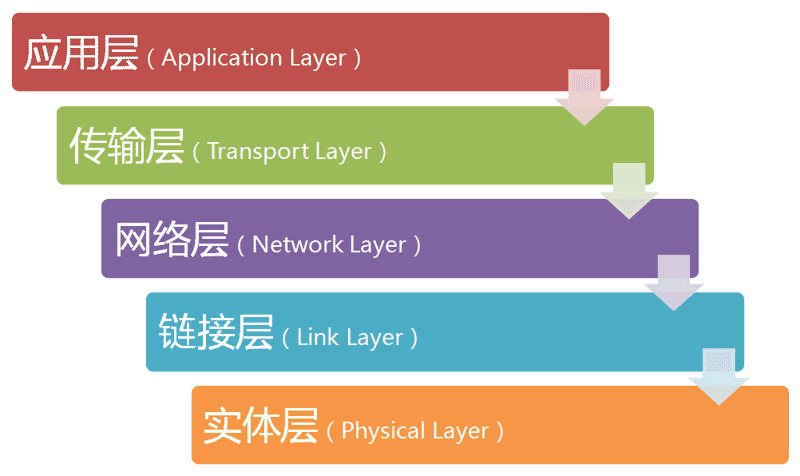
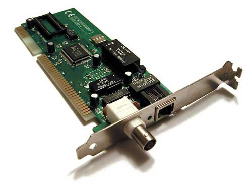
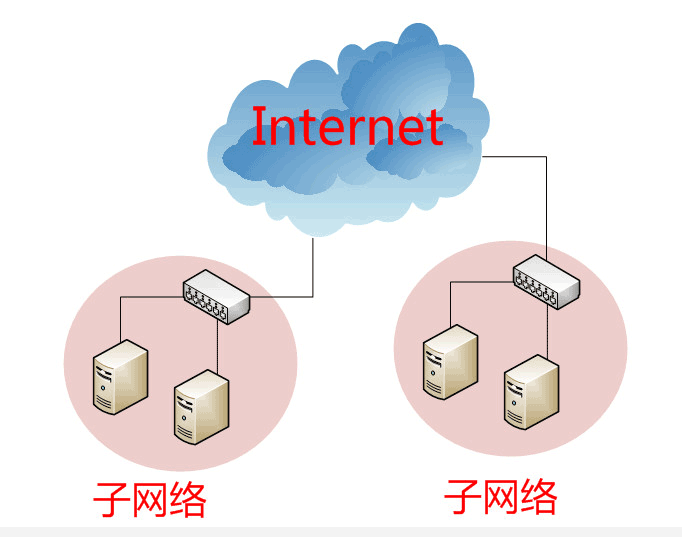

# 互联网协议

互联网的核心是一系列协议，总称为"互联网协议"（Internet Protocol Suite）。它们对电脑如何连接和组网，做出了详尽的规定。理解了这些协议，就理解了互联网的原理。

## 一、概述

### 1.1 五层模型

互联网的实现，分成好几层。每一层都有自己的功能，就像建筑物一样，每一层都靠下一层支持。

用户接触到的，只是最上面的一层，根本没有感觉到下面的层。要理解互联网，必须从最下层开始，自下而上理解每一层的功能。

如何分层有不同的模型，有的模型分七层，有的分成五层：

如上图所示，最底下的一层叫做"实体层"（Physical Layer），最上面的一层叫做"应用层"（Application Layer），中间的三层（自下而上）分别是"链接层"（Link Layer）、"网络层"（Network Layer）和"传输层"（Transport Layer）。越下面的层，越靠近硬件；越上面的层，越靠近用户。

### 1.2 层与协议

每一层都是为了完成一种功能。为了实现这些功能，就需要大家都遵守共同的规则。

大家都遵守的规则，就叫做"协议"（protocol）。

互联网的每一层，都定义了很多协议。这些协议的总称，就叫做"互联网协议"（Internet Protocol Suite）。它们是互联网的核心。

## 二、实体层

电脑要组网，第一件事要干什么？当然是先把电脑连起来，可以用光缆、电缆、双绞线、无线电波等方式。

这就叫做"实体层"，它就是把电脑连接起来的物理手段。它主要规定了网络的一些电气特性，作用是负责传送0和1的电信号。

## 三、链接层

### 3.1 定义

单纯的0和1没有任何意义，必须规定解读方式：多少个电信号算一组？每个信号位有何意义？

这就是"链接层"的功能，它在"实体层"的上方，确定了0和1的分组方式。

### 3.2 以太网协议

早期的时候，每家公司都有自己的电信号分组方式。逐渐地，一种叫做"以太网"（Ethernet）的协议，占据了主导地位。

以太网规定，一组电信号构成一个数据包，叫做"帧"（Frame）。每一帧分成两个部分：标头（Head）和数据（Data）。

"标头"包含数据包的一些说明项，比如发送者、接受者、数据类型等等；"数据"则是数据包的具体内容。

"标头"的长度，固定为18字节。"数据"的长度，最短为46字节，最长为1500字节。因此，整个"帧"最短为64字节，最长为1518字节。如果数据很长，就必须分割成多个帧进行发送。

### 3.3 MAC地址

上面提到，以太网数据包的"标头"，包含了发送者和接受者的信息。那么，发送者和接受者是如何标识呢？
以太网规定，连入网络的所有设备，都必须具有"网卡"接口。数据包必须是从一块网卡，传送到另一块网卡。网卡的地址，就是数据包的发送地址和接收地址，这叫做MAC地址。

每块网卡出厂的时候，都有一个全世界独一无二的MAC地址，长度是48个二进制位，通常用12个十六进制数表示。

前6个十六进制数是厂商编号，后6个是该厂商的网卡流水号。有了MAC地址，就可以定位网卡和数据包的路径了。

### 3.4 广播

定义地址只是第一步，后面还有更多的步骤。

首先，一块网卡怎么会知道另一块网卡的MAC地址？

回答是有一种ARP协议，可以解决这个问题。这个留到后面介绍，这里只需要知道，以太网数据包必须知道接收方的MAC地址，然后才能发送。

其次，就算有了MAC地址，系统怎样才能把数据包准确送到接收方？

回答是以太网采用了一种很"原始"的方式，它不是把数据包准确送到接收方，而是向本网络内所有计算机发送，让每台计算机自己判断，是否为接收方。

上图中，1号计算机向2号计算机发送一个数据包，同一个子网络的3号、4号、5号计算机都会收到这个包。它们读取这个包的"标头"，找到接收方的MAC地址，然后与自身的MAC地址相比较，如果两者相同，就接受这个包，做进一步处理，否则就丢弃这个包。这种发送方式就叫做"广播"（broadcasting）。

有了数据包的定义、网卡的MAC地址、广播的发送方式，"链接层"就可以在多台计算机之间传送数据了。

## 四、网络层

### 4.1 网络层的由来
以太网协议，依靠MAC地址发送数据。理论上，单单依靠MAC地址，上海的网卡就可以找到洛杉矶的网卡了，技术上是可以实现的。

但是，这样做有一个重大的缺点。以太网采用广播方式发送数据包，所有成员人手一"包"，不仅效率低，而且局限在发送者所在的子网络。也就是说，如果两台计算机不在同一个子网络，广播是传不过去的。这种设计是合理的，否则互联网上每一台计算机都会收到所有包，那会引起灾难。

互联网是无数子网络共同组成的一个巨型网络，很像想象上海和洛杉矶的电脑会在同一个子网络，这几乎是不可能的。

因此，必须找到一种方法，能够区分哪些MAC地址属于同一个子网络，哪些不是。如果是同一个子网络，就采用广播方式发送，否则就采用"路由"方式发送。遗憾的是，MAC地址本身无法做到这一点。它只与厂商有关，与所处网络无关。

这就导致了"网络层"的诞生。它的作用是引进一套新的地址，使得我们能够区分不同的计算机是否属于同一个子网络。这套地址就叫做"网络地址"，简称"网址"。

于是，"网络层"出现以后，每台计算机有了两种地址，一种是MAC地址，另一种是网络地址。两种地址之间没有任何联系，MAC地址是绑定在网卡上的，网络地址则是管理员分配的，它们只是随机组合在一起。

网络地址帮助我们确定计算机所在的子网络，MAC地址则将数据包送到该子网络中的目标网卡。因此，从逻辑上可以推断，必定是先处理网络地址，然后再处理MAC地址。

### 4.2 IP协议

规定网络地址的协议，叫做IP协议。它所定义的地址，就被称为IP地址。

目前，广泛采用的是IP协议第四版，简称IPv4。这个版本规定，网络地址由32个二进制位组成。

习惯上，我们用分成四段的十进制数表示IP地址，从0.0.0.0一直到255.255.255.255。

互联网上的每一台计算机，都会分配到一个IP地址。这个地址分成两个部分，前一部分代表网络，后一部分代表主机。比如，IP地址172.16.254.1，这是一个32位的地址，假定它的网络部分是前24位（172.16.254），那么主机部分就是后8位（最后的那个1）。处于同一个子网络的电脑，它们IP地址的网络部分必定是相同的，也就是说172.16.254.2应该与172.16.254.1处在同一个子网络。

但是，问题在于单单从IP地址，我们无法判断网络部分。还是以172.16.254.1为例，它的网络部分，到底是前24位，还是前16位，甚至前28位，从IP地址上是看不出来的。
那么，怎样才能从IP地址，判断两台计算机是否属于同一个子网络呢？这就要用到另一个参数"子网掩码"（subnet mask）。

所谓"子网掩码"，就是表示子网络特征的一个参数。它在形式上等同于IP地址，也是一个32位二进制数字，它的网络部分全部为1，主机部分全部为0。比如，IP地址172.16.254.1，如果已知网络部分是前24位，主机部分是后8位，那么子网络掩码就是11111111.11111111.11111111.00000000，写成十进制就是255.255.255.0。
知道"子网掩码"，我们就能判断，任意两个IP地址是否处在同一个子网络。方法是将两个IP地址与子网掩码分别进行AND运算（两个数位都为1，运算结果为1，否则为0），然后比较结果是否相同，如果是的话，就表明它们在同一个子网络中，否则就不是。

比如，已知IP地址172.16.254.1和172.16.254.233的子网掩码都是255.255.255.0，请问它们是否在同一个子网络？两者与子网掩码分别进行AND运算，结果都是172.16.254.0，因此它们在同一个子网络。
总结一下，IP协议的作用主要有两个，一个是为每一台计算机分配IP地址，另一个是确定哪些地址在同一个子网络。