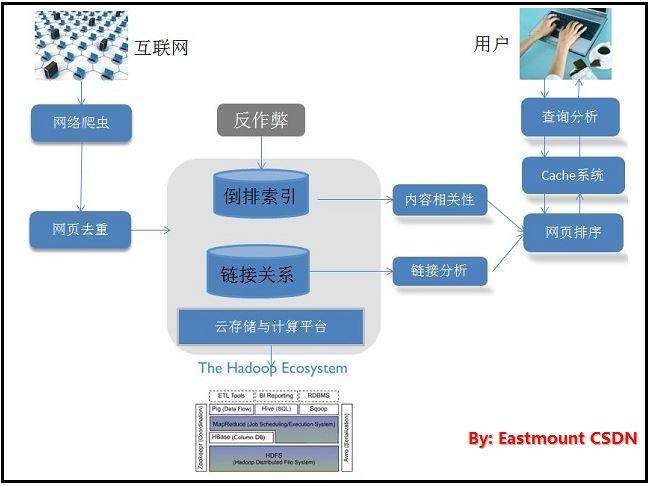

# 论文V1.0——搜索引擎
[TOC]

## 第1章 绪论

### 1.1 搜索引擎简介
随着因特网的迅猛发展、Web信息的增加，用户要在信息的海洋里查找信息，就像大海捞针一样，搜索引擎技术恰好解决了这一难题（它可以为用户提供信息检索服务）。目前，搜索引擎技术正成为计算机工业界和学术界争相研究、开发的对象。 **【摘抄自——[专业搜索引擎的研究与设计](http://kns.cnki.net/KCMS/detail/detail.aspx?dbcode=CMFD&dbname=CMFD0506&filename=2005040756.nh&uid=WEEvREcwSlJHSldRa1FhdXNXYXFuaVlxTFhDWC8zRVJGKzZMTWlrVnMyMD0=$9A4hF_YAuvQ5obgVAqNKPCYcEjKensW4ggI8Fm4gTkoUKaID8j8gFw!!&v=MDAxMzNaRWJQSVI4ZVgxTHV4WVM3RGgxVDNxVHJXTTFGckNVUkwyZVp1UnFGeS9oVTczTFYxMjdHN084SHRiSnE=)】**

Internet上面的信息庞大，并且没有规律，链接就像连接各个信息之间的桥梁，搜索引擎就像是一张地图，通过这张地图就能找到需要信息所在的位置。搜索引擎是通过人工手动方式或者具有单一功能的计算机程序在互联网上收集整理信息，通过一定的特殊方式对这些信息进行处理，用户通过输入查询信息并提交，计算机程序处理查询信息，通过相关算法产生查询结果，将查询结果按照预先设置的排序算法整理后返回给用户。从用户角度来说，用户通过查询框输入查询信息，便可以获得需要查询信息的列表，通过信息列表可以方便的访问包含该信息的完整页面。从计算机的角度来说，计算机做了大量的后台工作，包括获取网络信息、分析提取信息、建立索引、分析查询词、查询信息、返回信息排序等各种复杂工作。 **【摘抄自——[基于Solr的搜索引擎核心技术研究与应用](http://kns.cnki.net/KCMS/detail/detail.aspx?dbcode=CMFD&dbname=CMFD201402&filename=1013296472.nh&uid=WEEvREcwSlJHSldRa1FhdXNXYXFuaVlxTFhDWC8zRVJGKzZMTWlrVnMyMD0=$9A4hF_YAuvQ5obgVAqNKPCYcEjKensW4ggI8Fm4gTkoUKaID8j8gFw!!&v=MDk1NDd4R05YTHJaRWJQSVI4ZVgxTHV4WVM3RGgxVDNxVHJXTTFGckNVUkwyZVp1UnFGeS9oVjc3SlZGMjZIYkc=)】**

## 第2章 技术理论

### 2.1 垂直搜索系统的性能指标
数据采集和用户查询的效率是垂直搜索引擎系统至关重要的性能指标。垂直搜索引擎系统和传统的搜索引擎系统相似，要完成的基本任务就是：在可以接受的时间内返回一个最新领域内网页信息的与用户查询匹配的有序列表。这里面有三个需要重视的点：
* **可以接受的时间：**一般指垂直搜索引擎的响应时间，有研究[1]指出，作为Web公共服务，大型搜索引擎的响应时间不应超过3秒，垂直搜索引擎由于返回的网页信息列表与用户感兴趣的领域知识相关度较高，用户可以接受的系统响应时间也相对比较长，但是响应时间也应该保持在“秒”的量级，本文认为，一个高效的垂直搜索引擎系统响应时间不应该超过5秒。
* **最新领域内网页信息：**垂直搜索引擎的信息和数据都是从互联网上采集成的，如何尽量保证这些信息数据是最新的，就要求垂直搜索引擎索引的信息采集系统数据采集是高效、增量式的。
* **与用户查询匹配的有序列表：**在传统的搜索引擎中，“与用户匹配”一般就是指网页包含用户查询的关键词（中文查询需要分词后用多个关键词同时匹配），然而垂直搜索引擎由于数据源较为单一，数据与领域信息高度相关且高度集成，可以适当调整“与用户查询匹配”的定义，在一定的语义范围内，不包含用户查询关键词的网页或是数据条目也可以返回给用户，以自动拓展用户查询的语义。此时，我们需要一个完全不同的“用户查询匹配度”的排序方法，而且这个排序方法必须同时是高效的。

垂直搜索引擎面向的是海量的Web网页数据，与现代大规模、高性能的搜索引擎相同，采取三段式的工作流程，即网页数据采集、预处理和查询服务。
因此，高效的垂直搜索引擎必须具备以下三个特征：
1. 具备高稳定性和高效率的数据采集模块。要考虑如何非阻塞的并行化[2]基于主题的数据采集，建立域名解析（DNS）缓存[3]，有效的分配URL列表到多个Crawlor节点，同时对被采集网站服务器保持“礼貌”。
2. 高效的解析和存储网页数据。要考虑如何快速高效的解析并萃取网页文档，处理不同的网页、文件以及脚本的编码方式和语言（包括中文分词），以及如何建立高效的分布式、增量式索引。
3. 高性能的用户查询模块提供快速的系统响应。要考虑如何利用分布式的查询代理[4]完成分配查询任务、查询缓存到各个服务节点的任务。 **【摘抄自——[垂直搜索引擎若干问题研究](http://kns.cnki.net/KCMS/detail/detail.aspx?dbcode=CDFD&dbname=CDFD1214&filename=1012330814.nh&uid=WEEvREcwSlJHSldRa1Fhb09jMjVzQlJaVHFiV0lXVmdJdFlmRUt2aVhNWT0=$9A4hF_YAuvQ5obgVAqNKPCYcEjKensW4ggI8Fm4gTkoUKaID8j8gFw!!&v=MjQ3ODM2SExDN0h0bk5xNUViUElSOGVYMUx1eFlTN0RoMVQzcVRyV00xRnJDVVJMMmVadVJxRkNubVc3M1BWRjI=)】**

### 2.2 HTTP 协议

#### 2.2.1 HTTP协议
HTTP全称HyperText Transfer Protocol，超文本传输协议，是一种用于分布式、协作式和超媒体信息系统的应用层协议[5]。HTTP是万维网的数据通信的基础。
设计HTTP最初的目的是为了提供一种发布和接收HTML页面的方法。通过HTTP或者HTTPS协议请求的资源由统一资源标识符（Uniform Resource Identifiers，URI）来标识。
HTTP的发展是由蒂姆·伯纳斯-李于1989年在欧洲核子研究组织（CERN）所发起。HTTP的标准制定由万维网协会（World Wide Web Consortium，W3C）和互联网工程任务组（Internet Engineering Task Force，IETF）进行协调，最终发布了一系列的RFC，其中最著名的是1999年6月公布的 RFC 2616，定义了HTTP协议中现今广泛使用的一个版本——HTTP 1.1。
2014年12月，互联网工程任务组（IETF）的Hypertext Transfer Protocol Bis（httpbis）工作小组将HTTP/2标准提议递交至IESG进行讨论[6]，于2015年2月17日被批准。[7] HTTP/2标准于2015年5月以RFC 7540正式发表，取代HTTP 1.1成为HTTP的实现标准。[8]

#### 2.2.2 URL
URL（Uniform Resource Locator，统一资源定位符）。就像每家每户都有一个门牌地址一样，每个网页也有一个Internet地址。当用户在浏览器的地址框中输入一个URL或是单击一个超级链接时，URL就确定了要浏览的地址，浏览器会将URL翻译成所需信息。RFC2068对URL格式的定义如下：
例如：http://www.google.com/cn/zh.html。它的含义如下：
1. http:：代表超文本传输协议，通知www.google.com服务器显示Web网页，通常可以省略；
2. www：代表一个Web（万维网）服务器；
3. google.com：这是装有网页的服务器的域名，或者站点服务器的名称；
4. cn：该服务器上的子目录；
5. zh.html：zh.html是文件夹中的一个HTML文件，也就是用户要访问的信息。

#### 2.2.3 HTTP的工作原理
HTTP非工作主要由四个阶段组成：
（1）连接：目前，HTTP主要是运作在TCP/IP协议之上（HTTP的技术规范中并没有指定任何特殊传输协议作为其专用协议，唯一的要求是希望传输协议要有较高的可靠性），以TCP作为传输协议，采用客户机/服务器对话机制，在客户机向服务器发送请求之前，首先必须和目标资源的服务器（Server）相连接。
（2）请求：一个客户机与服务器建立连接以后，发送一个请求给服务器，请求方式的格式为：请求方法（通常是Get或Post）、统一资源标识符URL（通常是一个URL）、HTTP协议版本号，后边是MIME信息（包括请求修饰符、客户机信息和可能的内容）。
标准的HTTP请求信息
```json
POST /index.php HTTP/1.1
Host: localhost
User-Agent: Mozilla/5.0 (Windows NT 5.1; rv:10.0.2) Gecko/20100101 Firefox/10.0.2
Accept: text/html,application/xhtml+xml,application/xml;q=0.9,*/*;q=0.8
Accept-Language: zh-cn,zh;q=0.5
Accept-Encoding: gzip, deflate
Connection: keep-alive
Referer: http://localhost/
Content-Length：25
Content-Type：application/x-www-form-urlencoded
 
username=aa&password=1234
```
（3）响应：服务器接收到请求后，给客户端返回状态行信息，其中包括使用的HTTP协议版本号、一个成功或者错误的应答代码和一些MIME信息（包括服务器信息、实体信息和可能的内容）。
HTTP响应信息：
···json
HTTP/1.1 200 OK
Date: Sun, 17 Mar 2013 08:12:54 GMT
Server: Apache/2.2.8 (Win32) PHP/5.2.5
X-Powered-By: PHP/5.2.5
Set-Cookie: PHPSESSID=c0huq7pdkmm5gg6osoe3mgjmm3; path=/
Expires: Thu, 19 Nov 1981 08:52:00 GMT
Cache-Control: no-store, no-cache, must-revalidate, post-check=0, pre-check=0
Pragma: no-cache
Content-Length: 4393
Keep-Alive: timeout=5, max=100
Connection: Keep-Alive
Content-Type: text/html; charset=utf-8
···
（4）断开：一旦响应信息发出，Server关闭TCP/IP会话，完成事务处理全过程。HTTP的一个重要特点就是每个请求和其他请求是独立的。 **【摘抄自——[垂直搜索引擎若干问题研究](http://kns.cnki.net/KCMS/detail/detail.aspx?dbcode=CDFD&dbname=CDFD1214&filename=1012330814.nh&uid=WEEvREcwSlJHSldRa1Fhb09jMjVzQlJaVHFiV0lXVmdJdFlmRUt2aVhNWT0=$9A4hF_YAuvQ5obgVAqNKPCYcEjKensW4ggI8Fm4gTkoUKaID8j8gFw!!&v=MjQ3ODM2SExDN0h0bk5xNUViUElSOGVYMUx1eFlTN0RoMVQzcVRyV00xRnJDVVJMMmVadVJxRkNubVc3M1BWRjI=)】**

### 2.3 搜索引擎的分类
目前，Internet上的搜索引擎已不下数千种，从信息采集的角度来看，搜索引擎大体可以分为三大类：
#### 1. 目录式搜搜引擎
以人工或者半自动方式自动搜集信息，由编辑员查看信息之后，人工形成信息摘要，并将信息置于事先确定的框架中。信息大多面向网站，提供目录浏览服务和直接检索服务。该类搜索引擎因为加入了人的智能，所以信息准确、导航质量高，缺点是需要人工介入、维护量大、信息量少、信息更新不及时。这类搜索引擎的代表是：早期的Yahoo、LookSmart、Open Directory、Go Guide等。
#### 2. 基于Grawler的搜索引擎
通过网络蜘蛛（Crawler，Spider）等程序，这类搜索引擎以某种策略自动地在Internet中采集信息，由索引器为采集到的信息建立索引，由检索器根据用户的查询输入检索索引库，并将查询结果返回给用户。服务方式是面向网页的全文检索服务。该类搜索引擎的优点是信息量大、更新及时、不需要人工干预，缺点是返回信息过多，有很多无关信息，用户必须从结果中进行筛选。这类搜索引擎的代表是：Google、Bing、AltaVista、Northern Light、Excite、Infoseek等；国内代表为：百度、天网、有道deng。
#### 3. 元搜索引擎
这类搜索引擎本身并没有存放网页信息的数据库，当用户查询一个关键词时，它把用户的查询请求转换成其它搜索引擎能够接受的命令格式，并行地数个搜索引擎来查询这个关键词，将返回结果进行重复排除、重新排序等处理后，作为自己的结果返回给用户。
Meta搜索引擎（元搜索引擎）其实只是一种用户代理，而不是真正的搜索引擎。多数Meta搜索引擎在处理其他搜索引擎的返回结果时，只提取每个搜索引擎的结果中前面10~50条，并将这些条目合并在一起返回给用户，因此最后结果的数量可能会远少于直接在一个搜索引擎上进行查找所得到的数量，这类搜索引擎的代表有：WebCrawler、InfoMarket等。 **【摘抄自——[垂直搜索引擎若干问题研究](http://kns.cnki.net/KCMS/detail/detail.aspx?dbcode=CDFD&dbname=CDFD1214&filename=1012330814.nh&uid=WEEvREcwSlJHSldRa1Fhb09jMjVzQlJaVHFiV0lXVmdJdFlmRUt2aVhNWT0=$9A4hF_YAuvQ5obgVAqNKPCYcEjKensW4ggI8Fm4gTkoUKaID8j8gFw!!&v=MjQ3ODM2SExDN0h0bk5xNUViUElSOGVYMUx1eFlTN0RoMVQzcVRyV00xRnJDVVJMMmVadVJxRkNubVc3M1BWRjI=)】**

### 2.4 搜索引擎的基本结构
如前所述，目前的搜索引擎虽然有多种形式，但在设计的基本结构上大都是由三大模块组成：
* 信息采集：信息采集模块主要完成从Internet上发现Web站点和URL并采集信息的功能；
* 数据组织：数据组织模块完成对采集到的信息进行整理，形成规范的页面索引，并建立相应的索引数据库；
* 用户查询：用户查询模块的作用是提供用户查询输入、显示查询结果、提供用户相关性反馈机制。



**【摘抄自——[垂直搜索引擎若干问题研究](http://kns.cnki.net/KCMS/detail/detail.aspx?dbcode=CDFD&dbname=CDFD1214&filename=1012330814.nh&uid=WEEvREcwSlJHSldRa1Fhb09jMjVzQlJaVHFiV0lXVmdJdFlmRUt2aVhNWT0=$9A4hF_YAuvQ5obgVAqNKPCYcEjKensW4ggI8Fm4gTkoUKaID8j8gFw!!&v=MjQ3ODM2SExDN0h0bk5xNUViUElSOGVYMUx1eFlTN0RoMVQzcVRyV00xRnJDVVJMMmVadVJxRkNubVc3M1BWRjI=)】**

## 第3章 软件设计

## 第4章 测试

### 4.1 DNS解析优化
Web Crawler会不断地产生新的URL链接进行访问，大量的URL链接会产生许多新的主机域名，每一个新的主机域名都需要访问DNS服务器进行解析，如果不采取措施，DNS地址解析会成为Web Crawler一个非常重要的瓶颈。
在局域网中的DNS服务器通常压力较小，完成几百个工作站甚至几千个工作站的常规DNS解析没有性能上的问题，但一个高性能、高并发的Web Crawler产生的DNS解析压力会大很多，甚于前述的礼貌原则，Web Crawler避免同时从同一个服务器抓取许多网页也使DNS的缓存能力发挥不出来[9]。
在本文的Web Crawler系统中设计了一个专用的DNS模块，含有用于地址解析的DNS Client（与DNS缓存服务器交互）。定制的预取DNS Client用于高效的地址解析，一般系统（例如UNIX）提供的DNS Client没有考虑Crawler的需求，带来两个问题：第一、以gethostbyname()为基础，它不能并发，不会考虑多个DNS Server之间分配负载，因此设计并实现一个定制的DNS Client很必要。专门应对多个请求的并发处理一次性发出多个解析请求，通过polling来看请求的完成情况，协助在多个DNS Server之间做负载分配（例如根据掌握的URL进行适当调度）。第二、保持最新Internet内容的DNS系统会定期刷新，与其他的DNS服务器交换更新域名和IP的信息。普通的DNS cache一般应尊重上级DNS服务器带来的域名”过期”的信息，但用于爬取网页的DNS cache不需要如此，以减小开销（缓存中允许一些过期，但需要注意安排适时刷新）映射尽量放在内存，本文在Web Crawler系统中使用一台专门的PC作为预取DNS Client，为了减少查找新主机地址的时间，尽早将主机名投给DNS系统，步骤如下：
* 分析刚得到的网页
* 从HREF属性中提取主机名（不是完整的URL）
* 向缓存服务器提交DNS解析请求
* 结果放到DNS cache中，通常用UDP来实现DNS解析，UDP不保证包的投递，不用等解析完成。 **【摘抄自——[垂直搜索引擎若干问题研究](http://kns.cnki.net/KCMS/detail/detail.aspx?dbcode=CDFD&dbname=CDFD1214&filename=1012330814.nh&uid=WEEvREcwSlJHSldRa1Fhb09jMjVzQlJaVHFiV0lXVmdJdFlmRUt2aVhNWT0=$9A4hF_YAuvQ5obgVAqNKPCYcEjKensW4ggI8Fm4gTkoUKaID8j8gFw!!&v=MjQ3ODM2SExDN0h0bk5xNUViUElSOGVYMUx1eFlTN0RoMVQzcVRyV00xRnJDVVJMMmVadVJxRkNubVc3M1BWRjI=)】**

## 第5章 总结

## 参考文献
[1] Bernard J. Jansen, Amanda Spink; How are we searching the World Wide Web? A comparison of nine search transaction logs. lnf. Process. Manage.(IPM) 42(1);248-263(2006)

[2] Mining the Web:Discovering Knowl-edge from Hypertext Data. Soumen Chakrabarti. . 2003

[3] IRLbot: scaling to 6 billion pages and beyond. Hsin-Tsang Lee,Derek Leonard,Wang Xiaoming, et al. Proceedings of the 17th International World Wide Web Conference . 2008

[4] The impact of caching on search engines. Ricardo A Baeza-Yates,Aristides Gionis,Flavio Junqueira,Vanessa Murdock,Vassilis Plachouras,Fabrizio Silvestri. SIGIR . 2007

[5] Fielding, Roy T.; Gettys, James; Mogul, Jeffrey C.; Nielsen, Henrik Frystyk; Masinter, Larry; Leach, Paul J.; Berners-Lee, Tim. Hypertext Transfer Protocol – HTTP/1.1. IETF. June 1999. RFC 2616.

[6] Raymor, Brian. Wait for it – HTTP/2 begins Working Group Last Call!. Microsoft Open Technologies. 2014-08-07.

[7] Mark Nottingham. HTTP/2 Approved. www.ietf.org. Internet Engineering Task Force. 2015-02-18.

[8]  RFC 7540 - Hypertext Transfer Protocol Version 2 (HTTP/2). IETF. May 2015 [14 May 2015].


## 致谢

## 附录