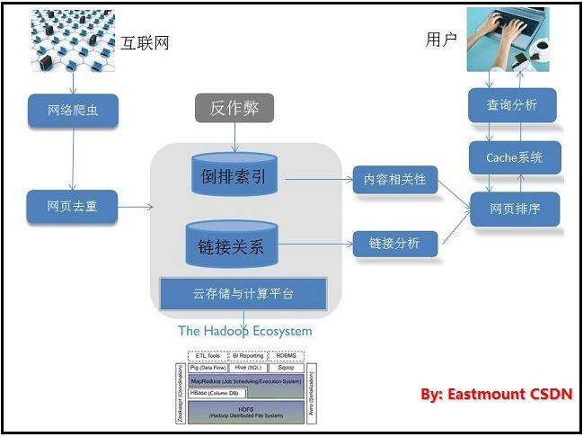
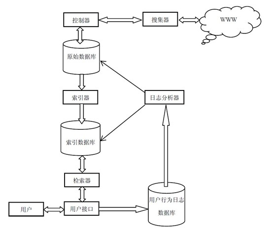

# 论文V1.0——搜索引擎

## 第1章 绪论

### 1.1 搜索引擎简介
随着因特网的迅猛发展、Web信息的增加，用户要在信息的海洋里查找信息，就像大海捞针一样，搜索引擎技术恰好解决了这一难题（它可以为用户提供信息检索服务）。目前，搜索引擎技术正成为计算机工业界和学术界争相研究、开发的对象。 **【摘抄自——[专业搜索引擎的研究与设计](http://kns.cnki.net/KCMS/detail/detail.aspx?dbcode=CMFD&dbname=CMFD0506&filename=2005040756.nh&uid=WEEvREcwSlJHSldRa1FhdXNXYXFuaVlxTFhDWC8zRVJGKzZMTWlrVnMyMD0=$9A4hF_YAuvQ5obgVAqNKPCYcEjKensW4ggI8Fm4gTkoUKaID8j8gFw!!&v=MDAxMzNaRWJQSVI4ZVgxTHV4WVM3RGgxVDNxVHJXTTFGckNVUkwyZVp1UnFGeS9oVTczTFYxMjdHN084SHRiSnE=)】**

Internet上面的信息庞大，并且没有规律，链接就像连接各个信息之间的桥梁，搜索引擎就像是一张地图，通过这张地图就能找到需要信息所在的位置。搜索引擎是通过人工手动方式或者具有单一功能的计算机程序在互联网上收集整理信息，通过一定的特殊方式对这些信息进行处理，用户通过输入查询信息并提交，计算机程序处理查询信息，通过相关算法产生查询结果，将查询结果按照预先设置的排序算法整理后返回给用户。从用户角度来说，用户通过查询框输入查询信息，便可以获得需要查询信息的列表，通过信息列表可以方便的访问包含该信息的完整页面。从计算机的角度来说，计算机做了大量的后台工作，包括获取网络信息、分析提取信息、建立索引、分析查询词、查询信息、返回信息排序等各种复杂工作。 **【摘抄自——[基于Solr的搜索引擎核心技术研究与应用](http://kns.cnki.net/KCMS/detail/detail.aspx?dbcode=CMFD&dbname=CMFD201402&filename=1013296472.nh&uid=WEEvREcwSlJHSldRa1FhdXNXYXFuaVlxTFhDWC8zRVJGKzZMTWlrVnMyMD0=$9A4hF_YAuvQ5obgVAqNKPCYcEjKensW4ggI8Fm4gTkoUKaID8j8gFw!!&v=MDk1NDd4R05YTHJaRWJQSVI4ZVgxTHV4WVM3RGgxVDNxVHJXTTFGckNVUkwyZVp1UnFGeS9oVjc3SlZGMjZIYkc=)】**

## 第2章 技术理论

### 2.1 垂直搜索系统的性能指标
数据采集和用户查询的效率是垂直搜索引擎系统至关重要的性能指标。垂直搜索引擎系统和传统的搜索引擎系统相似，要完成的基本任务就是：在可以接受的时间内返回一个最新领域内网页信息的与用户查询匹配的有序列表。这里面有三个需要重视的点：
* <b>可以接受的时间：</b>一般指垂直搜索引擎的响应时间，有研究[1]指出，作为Web公共服务，大型搜索引擎的响应时间不应超过3秒，垂直搜索引擎由于返回的网页信息列表与用户感兴趣的领域知识相关度较高，用户可以接受的系统响应时间也相对比较长，但是响应时间也应该保持在“秒”的量级，本文认为，一个高效的垂直搜索引擎系统响应时间不应该超过5秒。
* <b>最新领域内网页信息：</b>垂直搜索引擎的信息和数据都是从互联网上采集成的，如何尽量保证这些信息数据是最新的，就要求垂直搜索引擎索引的信息采集系统数据采集是高效、增量式的。
* <b>与用户查询匹配的有序列表：</b>在传统的搜索引擎中，“与用户匹配”一般就是指网页包含用户查询的关键词（中文查询需要分词后用多个关键词同时匹配），然而垂直搜索引擎由于数据源较为单一，数据与领域信息高度相关且高度集成，可以适当调整“与用户查询匹配”的定义，在一定的语义范围内，不包含用户查询关键词的网页或是数据条目也可以返回给用户，以自动拓展用户查询的语义。此时，我们需要一个完全不同的“用户查询匹配度”的排序方法，而且这个排序方法必须同时是高效的。

垂直搜索引擎面向的是海量的Web网页数据，与现代大规模、高性能的搜索引擎相同，采取三段式的工作流程，即网页数据采集、预处理和查询服务。
因此，高效的垂直搜索引擎必须具备以下三个特征：
1. 具备高稳定性和高效率的数据采集模块。要考虑如何非阻塞的并行化[2]基于主题的数据采集，建立域名解析（DNS）缓存[3]，有效的分配URL列表到多个Crawlor节点，同时对被采集网站服务器保持“礼貌”。
2. 高效的解析和存储网页数据。要考虑如何快速高效的解析并萃取网页文档，处理不同的网页、文件以及脚本的编码方式和语言（包括中文分词），以及如何建立高效的分布式、增量式索引。
3. 高性能的用户查询模块提供快速的系统响应。要考虑如何利用分布式的查询代理[4]完成分配查询任务、查询缓存到各个服务节点的任务。 **【摘抄自——[垂直搜索引擎若干问题研究](http://kns.cnki.net/KCMS/detail/detail.aspx?dbcode=CDFD&dbname=CDFD1214&filename=1012330814.nh&uid=WEEvREcwSlJHSldRa1Fhb09jMjVzQlJaVHFiV0lXVmdJdFlmRUt2aVhNWT0=$9A4hF_YAuvQ5obgVAqNKPCYcEjKensW4ggI8Fm4gTkoUKaID8j8gFw!!&v=MjQ3ODM2SExDN0h0bk5xNUViUElSOGVYMUx1eFlTN0RoMVQzcVRyV00xRnJDVVJMMmVadVJxRkNubVc3M1BWRjI=)】**

### 2.2 HTTP 协议

#### 2.2.1 HTTP协议
HTTP全称HyperText Transfer Protocol，超文本传输协议，是一种用于分布式、协作式和超媒体信息系统的应用层协议[5]。HTTP是万维网的数据通信的基础。

设计HTTP最初的目的是为了提供一种发布和接收HTML页面的方法。通过HTTP或者HTTPS协议请求的资源由统一资源标识符（Uniform Resource Identifiers，URI）来标识。

HTTP的发展是由蒂姆·伯纳斯-李于1989年在欧洲核子研究组织（CERN）所发起。HTTP的标准制定由万维网协会（World Wide Web Consortium，W3C）和互联网工程任务组（Internet Engineering Task Force，IETF）进行协调，最终发布了一系列的RFC，其中最著名的是1999年6月公布的 RFC 2616，定义了HTTP协议中现今广泛使用的一个版本——HTTP 1.1。
2014年12月，互联网工程任务组（IETF）的Hypertext Transfer Protocol Bis（httpbis）工作小组将HTTP/2标准提议递交至IESG进行讨论[6]，于2015年2月17日被批准。[7] HTTP/2标准于2015年5月以RFC 7540正式发表，取代HTTP 1.1成为HTTP的实现标准。[8]

#### 2.2.2 URL

URL（Uniform Resource Locator，统一资源定位符）。就像每家每户都有一个门牌地址一样，每个网页也有一个Internet地址。当用户在浏览器的地址框中输入一个URL或是单击一个超级链接时，URL就确定了要浏览的地址，浏览器会将URL翻译成所需信息。RFC2068对URL格式的定义如下：
例如：http://www.google.com/cn/zh.html。它的含义如下：
1. http:：代表超文本传输协议，通知www.google.com服务器显示Web网页，通常可以省略；
2. www：代表一个Web（万维网）服务器；
3. google.com：这是装有网页的服务器的域名，或者站点服务器的名称；
4. cn：该服务器上的子目录；
5. zh.html：zh.html是文件夹中的一个HTML文件，也就是用户要访问的信息。

#### 2.2.3 HTTP的工作原理

HTTP非工作主要由四个阶段组成：
（1）连接：目前，HTTP主要是运作在TCP/IP协议之上（HTTP的技术规范中并没有指定任何特殊传输协议作为其专用协议，唯一的要求是希望传输协议要有较高的可靠性），以TCP作为传输协议，采用客户机/服务器对话机制，在客户机向服务器发送请求之前，首先必须和目标资源的服务器（Server）相连接。
（2）请求：一个客户机与服务器建立连接以后，发送一个请求给服务器，请求方式的格式为：请求方法（通常是Get或Post）、统一资源标识符URL（通常是一个URL）、HTTP协议版本号，后边是MIME信息（包括请求修饰符、客户机信息和可能的内容）。
标准的HTTP请求信息
```json
POST /index.php HTTP/1.1
Host: localhost
User-Agent: Mozilla/5.0 (Windows NT 5.1; rv:10.0.2) Gecko/20100101 Firefox/10.0.2
Accept: text/html,application/xhtml+xml,application/xml;q=0.9,*/*;q=0.8
Accept-Language: zh-cn,zh;q=0.5
Accept-Encoding: gzip, deflate
Connection: keep-alive
Referer: http://localhost/
Content-Length：25
Content-Type：application/x-www-form-urlencoded
 
username=aa&password=1234
```
（3）响应：服务器接收到请求后，给客户端返回状态行信息，其中包括使用的HTTP协议版本号、一个成功或者错误的应答代码和一些MIME信息（包括服务器信息、实体信息和可能的内容）。
HTTP响应信息：
```json
HTTP/1.1 200 OK
Date: Sun, 17 Mar 2013 08:12:54 GMT
Server: Apache/2.2.8 (Win32) PHP/5.2.5
X-Powered-By: PHP/5.2.5
Set-Cookie: PHPSESSID=c0huq7pdkmm5gg6osoe3mgjmm3; path=/
Expires: Thu, 19 Nov 1981 08:52:00 GMT
Cache-Control: no-store, no-cache, must-revalidate, post-check=0, pre-check=0
Pragma: no-cache
Content-Length: 4393
Keep-Alive: timeout=5, max=100
Connection: Keep-Alive
Content-Type: text/html; charset=utf-8
```
（4）断开：一旦响应信息发出，Server关闭TCP/IP会话，完成事务处理全过程。HTTP的一个重要特点就是每个请求和其他请求是独立的。 **【摘抄自——[垂直搜索引擎若干问题研究](http://kns.cnki.net/KCMS/detail/detail.aspx?dbcode=CDFD&dbname=CDFD1214&filename=1012330814.nh&uid=WEEvREcwSlJHSldRa1Fhb09jMjVzQlJaVHFiV0lXVmdJdFlmRUt2aVhNWT0=$9A4hF_YAuvQ5obgVAqNKPCYcEjKensW4ggI8Fm4gTkoUKaID8j8gFw!!&v=MjQ3ODM2SExDN0h0bk5xNUViUElSOGVYMUx1eFlTN0RoMVQzcVRyV00xRnJDVVJMMmVadVJxRkNubVc3M1BWRjI=)】**

### 2.3 搜索引擎的基本结构

如前所述，目前的搜索引擎虽然有多种形式，但在设计的基本结构上大都是由三大模块组成：
* 信息采集：信息采集模块主要完成从Internet上发现Web站点和URL并采集信息的功能；
* 数据组织：数据组织模块完成对采集到的信息进行整理，形成规范的页面索引，并建立相应的索引数据库；
* 用户查询：用户查询模块的作用是提供用户查询输入、显示查询结果、提供用户相关性反馈机制。



**【摘抄自——[垂直搜索引擎若干问题研究](http://kns.cnki.net/KCMS/detail/detail.aspx?dbcode=CDFD&dbname=CDFD1214&filename=1012330814.nh&uid=WEEvREcwSlJHSldRa1Fhb09jMjVzQlJaVHFiV0lXVmdJdFlmRUt2aVhNWT0=$9A4hF_YAuvQ5obgVAqNKPCYcEjKensW4ggI8Fm4gTkoUKaID8j8gFw!!&v=MjQ3ODM2SExDN0h0bk5xNUViUElSOGVYMUx1eFlTN0RoMVQzcVRyV00xRnJDVVJMMmVadVJxRkNubVc3M1BWRjI=)】**

### 2.4 搜索引擎的工作原理

搜索引擎的工作原理可以分为3步：首先，通过“一传十，十传百”的策略遍历互联网上的所有页面，获取网页信息；然后对这些信息进行过滤、提取、优化、建立并压缩索引；最后用户提交搜索内容，对这些关键字进行查询，对信息进行相关度计算，并对返回结果根据重要性进行排序，并将排序结果返回给用户[9]。
抓取信息。搜索引擎利用网络蜘蛛程序自动不间断的抓取网页信息，spider按照链接的方向不停的获取网页信息，遇到死链接则按照原先设定的算法处理，然后继续抓取后续的网页。因为互联网是一张连续的网络，通常是可以获得大多数信息的。

处理信息。网络蜘蛛抓取到网页后，搜索引擎需要做大量的工作，包括去重、提取关键字、分词、计算网页优先级、建立索引等工作。若不是建立索引，每次查找需要遍历所有抓取到的页面，所需时间与工作量是无法达到的。
提供检索。用户输入关键字进行查询，服务器同时处理数以万计的搜索请求，并在极短的时间内将搜索结果返回，通常返回的结果是一小段高亮显示的与关键值匹配的查询结果及对应页面的超级链接，用户通过超级链接能够查看原始网页的信息。

搜索引擎各不相同，通常由以下四个部分组成：搜集器（Collector）、索引器（Indexr）、索引库（Index Databases）、检索器（Search）。
搜集器就是网络爬虫，搜索引擎主要是靠搜索器搜集网络上的数据，并且通过一定的算法防止死链接或者无效链接。为了更新搜索库中信息，它必须也要做到频繁抓取更新的网页。

索引器是生成索引的模块，它将搜索的网页信息分析、拆分、归并，将文档信息建立倒排，提交给索引库。
索引库就是存放索引的地方，存放在索引库中的是倒排文件索引。将正向过程是通过文档（Document）——>词语（Words），索引库中存储的信息是通过词语（Words）——>文档（Document），这就是倒排索引，例如：通过查询“中国”则返回“文档一“和”文档二”。

检索器主要是用于检索和查询信息的模块，用户提交查询请求，检索器经过分词处理，在索引库中查询关键字，并将查询的信息以一定的格式返回给用户。



搜索引擎的工作原理如图，搜索器，索引器、索引库、检索器是搜索引擎的四大核心模块，不同的搜索引擎千差万别，但主要都是通过这四大模块作为核心和基础，只是一些细节的实现不同，搜索引擎还要以其他的模块作为辅助。 **【摘抄自——[基于Solr的搜索引擎核心技术研究与应用](http://kns.cnki.net/KCMS/detail/detail.aspx?dbcode=CMFD&dbname=CMFD201402&filename=1013296472.nh&uid=WEEvREcwSlJHSldRa1FhdXNXYXFuaVlxTFhDWC8zRVJGKzZMTWlrVnMyMD0=$9A4hF_YAuvQ5obgVAqNKPCYcEjKensW4ggI8Fm4gTkoUKaID8j8gFw!!&v=MDk1NDd4R05YTHJaRWJQSVI4ZVgxTHV4WVM3RGgxVDNxVHJXTTFGckNVUkwyZVp1UnFGeS9oVjc3SlZGMjZIYkc=)】**

### 2.5 搜索引擎划分
搜索引擎根据工作方式不同可划分为：元搜索引擎（Meta Search Engine）、目录搜索引擎（Search Index/Directory）和全文搜索引擎（Full Text Search Engine）[12]。

元搜索引擎一般都没有自己的机器人及数据库，它提供是搜索服务数据来源于其它各种搜索引擎，过程是将用户的请求安排在各种搜索引擎中查询，将其它搜索引擎返回的查询数据进行处理，并在同一风格的搜索界面上返回信息。这种搜索引擎比较流行的有很多，例如国外的Clusty、ZapMeta等，国内的搜魅网、比比猫等。

目录搜索引擎是用手动或者半自动方式建立起来的链接分级目录。其典型代表主要是上世纪末比较流行的Yahoo。

全文搜索引擎的主要代表莫过于google和百度，它是名副其实的搜索引擎。顾名思义，它是对网页全部信息进行检索的搜索引擎，是目前最广泛使用的搜索引擎。它获取网页的全部数据是通过网络爬虫实现，然后建立索引库存放获取的有效数据，通过在索引库中建立检索，通过一定的排序规则返回查询结果的信息，将返回信息以良好的交互界面显示给用户。

还有两种搜索方式比较流行：垂直搜索和分面搜索，它们目前在企业内部和电子商务中使用较多。 **【摘抄自——[基于Solr的搜索引擎核心技术研究与应用](http://kns.cnki.net/KCMS/detail/detail.aspx?dbcode=CMFD&dbname=CMFD201402&filename=1013296472.nh&uid=WEEvREcwSlJHSldRa1FhdXNXYXFuaVlxTFhDWC8zRVJGKzZMTWlrVnMyMD0=$9A4hF_YAuvQ5obgVAqNKPCYcEjKensW4ggI8Fm4gTkoUKaID8j8gFw!!&v=MDk1NDd4R05YTHJaRWJQSVI4ZVgxTHV4WVM3RGgxVDNxVHJXTTFGckNVUkwyZVp1UnFGeS9oVjc3SlZGMjZIYkc=)】**

## 第3章 软件设计

### 3.1 开发环境

* 操作系统：Mac OS、Linux
* 开发语言：Python、Node.Js
* 数据库：elasticSearch
* Elasticsearch版本：5.1.1
* Python版本：3.6.2
* 开发工具：Sublime Text3、pycharm、Anaconda 5.0.1
* 测试框架：selenium3.6.0

### 3.2 技术介绍

本系统的四个模块对应四个工程，其中信息搜索模块、索引模块与搜索模块是B/S (Browser/Server)模式的，信息解析模式是应用程序模式，使用Django作为服务器运行Web项目，搜索模块的人性化操作使用jQuery技术。

#### 1 Django(这里现在使用Python的这个框架实现，以后我想改成NodeJS来实现)

Django是一个开放源代码的Web应用框架，由Python写成。采用了MVT的软件设计模式，即模型Model，视图View和模板Template。

Django可以运行在启用了mod python的Apache 2上，或是任何WSGI兼容的Web服务器。Django也有启动FastCGI服务的能力，因此能够应用于任何支持FastCGI的机器上。

Django框架的核心包括：一个 面向对象 的映射器，用作数据模型（以Python类的形式定义）和关系性数据库间的媒介；一个基于正则表达式的URL分发器；一个视图系统，用于处理请求；以及一个模板系统。

#### 2 MVT

* M全拼为Model，与MVC中的M功能相同，负责和数据库交互，进行数据处理。
* V全拼为View，与MVC中的C功能相同，接收请求，进行业务处理，返回应答。
* V全拼为View，与MVC中的C功能相同，接收请求，进行业务处理，返回应答。

#### 3 jQuery

提到JQuery不得不先提到Ajax，它是一种页面与服务器交互的新技术。传统的网页请求是将网页的所有信息发送后台处理，Ajax是使用XMLHttpRequest对象，将网页的部分内容单独的实时传递到后台，这样就减少了发送整个页面的网络负载和请求数据量的大小。

JQuery是一个快速、简短、特征丰富的JavaScript库，它可以适用于各种浏览器，提供了更方便的HTNL文档遍历和操作、时间处理和动画效果，提供了便于使用的API可以让用户简单的使用Ajax功能。JQuery是免费开源的JavaScript框架，更多的程序员逐渐加入到了研发与使用的队伍。本搜索引擎的关键词提示功能就用到了Ajax。

#### 4 selenium

Selenium是一个用于Web应用程序测试的工具。Selenium测试直接运行在浏览器中，就像真正的用户在操作一样。支持的浏览器包括IE（7, 8, 9, 10, 11），Mozilla Firefox，Safari，Google Chrome，Opera等。这个工具的主要功能包括：测试与浏览器的兼容性——测试你的应用程序看是否能够很好得工作在不同浏览器和操作系统之上。测试系统功能——创建回归测试检验软件功能和用户需求。支持自动录制动作和自动生成 .Net、Java、Perl等不同语言的测试脚本。

## 第4章 测试

### 4.1 DNS解析优化
Web Crawler会不断地产生新的URL链接进行访问，大量的URL链接会产生许多新的主机域名，每一个新的主机域名都需要访问DNS服务器进行解析，如果不采取措施，DNS地址解析会成为Web Crawler一个非常重要的瓶颈。

在局域网中的DNS服务器通常压力较小，完成几百个工作站甚至几千个工作站的常规DNS解析没有性能上的问题，但一个高性能、高并发的Web Crawler产生的DNS解析压力会大很多，甚于前述的礼貌原则，Web Crawler避免同时从同一个服务器抓取许多网页也使DNS的缓存能力发挥不出来[9]。

在本文的Web Crawler系统中设计了一个专用的DNS模块，含有用于地址解析的DNS Client（与DNS缓存服务器交互）。定制的预取DNS Client用于高效的地址解析，一般系统（例如UNIX）提供的DNS Client没有考虑Crawler的需求，带来两个问题：第一、以gethostbyname()为基础，它不能并发，不会考虑多个DNS Server之间分配负载，因此设计并实现一个定制的DNS Client很必要。专门应对多个请求的并发处理一次性发出多个解析请求，通过polling来看请求的完成情况，协助在多个DNS Server之间做负载分配（例如根据掌握的URL进行适当调度）。第二、保持最新Internet内容的DNS系统会定期刷新，与其他的DNS服务器交换更新域名和IP的信息。普通的DNS cache一般应尊重上级DNS服务器带来的域名”过期”的信息，但用于爬取网页的DNS cache不需要如此，以减小开销（缓存中允许一些过期，但需要注意安排适时刷新）映射尽量放在内存，本文在Web Crawler系统中使用一台专门的PC作为预取DNS Client，为了减少查找新主机地址的时间，尽早将主机名投给DNS系统，步骤如下：
* 分析刚得到的网页
* 从HREF属性中提取主机名（不是完整的URL）
* 向缓存服务器提交DNS解析请求
* 结果放到DNS cache中，通常用UDP来实现DNS解析，UDP不保证包的投递，不用等解析完成。 **【摘抄自——[垂直搜索引擎若干问题研究](http://kns.cnki.net/KCMS/detail/detail.aspx?dbcode=CDFD&dbname=CDFD1214&filename=1012330814.nh&uid=WEEvREcwSlJHSldRa1Fhb09jMjVzQlJaVHFiV0lXVmdJdFlmRUt2aVhNWT0=$9A4hF_YAuvQ5obgVAqNKPCYcEjKensW4ggI8Fm4gTkoUKaID8j8gFw!!&v=MjQ3ODM2SExDN0h0bk5xNUViUElSOGVYMUx1eFlTN0RoMVQzcVRyV00xRnJDVVJMMmVadVJxRkNubVc3M1BWRjI=)】**

### 4.2 缓存设计

响应速度对搜索引擎来说至关重要，而搜索引擎是存储在磁盘上，在搜索的过程中需要对磁盘上的索引频繁读取操作是一个缓慢的过程，需要耗费很多的时间而影响系统的响应速度。多个用户进行查询的时候，就会存在重复查询的情况，所以将一些数据放入缓存中就会大大加快查询的速度。

#### 4.2.1 缓存使用

ElasticSearch核心实际是采用一个 bitset 记录与过滤器匹配的文档。Elasticsearch 积极地把这些 bitset 缓存起来以备随后使用。一旦缓存成功，bitset 可以复用 任何 已使用过的相同过滤器，而无需再次计算整个过滤器。

这些 bitsets 缓存是“智能”的：它们以增量方式更新。当我们索引新文档时，只需将那些新文档加入已有 bitset，而不是对整个缓存一遍又一遍的重复计算。和系统其他部分一样，过滤器是实时的，我们无需担心缓存过期问题。

#### 4.2.2 自动缓存

在 Elasticsearch 的较早版本中，默认的行为是缓存一切可以缓存的对象。这也通常意味着系统缓存 bitsets 太富侵略性，从而因为清理缓存带来性能压力。不仅如此，尽管很多过滤器都很容易被评价，但本质上是慢于缓存的（以及从缓存中复用）。缓存这些过滤器的意义不大，因为可以简单地再次执行过滤器。

检查一个倒排是非常快的，然后绝大多数查询组件却很少使用它。例如 term 过滤字段 "user_id" ：如果有上百万的用户，每个具体的用户 ID 出现的概率都很小。那么为这个过滤器缓存 bitsets 就不是很合算，因为缓存的结果很可能在重用之前就被剔除了。

这种缓存的扰动对性能有着严重的影响。更严重的是，它让开发者难以区分有良好表现的缓存以及无用缓存。

为了解决问题，Elasticsearch 会基于使用频次自动缓存查询。如果一个非评分查询在最近的 256 词查询中被使用过（次数取决于查询类型），那么这个查询就会作为缓存的候选。但是，并不是所有的片段都能保证缓存 bitset 。只有那些文档数量超过 10,000 （或超过总文档数量的 3% )才会缓存 bitset 。因为小的片段可以很快的进行搜索和合并，这里缓存的意义不大。

一旦缓存了，非评分计算的 bitset 会一直驻留在缓存中直到它被剔除。剔除规则是基于 LRU 的：一旦缓存满了，最近最少使用的过滤器会被剔除。

### 4.3 ElasticSearch5.1.1分布式集群部署

#### 4.3.1 部署环境
* 操作系统：Ubuntu14.14、Mac OS 10.10
* ElasticSearch版本：ElasticSearch-rtf-5.1.1
* JDK版本：jdk1.8.0_144
* 服务器：
  * 192.168.1.164（主节点、数据节点）
  * 192.168.1.128（主节点、数据节点）
  * 192.168.1.110（数据节点）

#### 4.3.2 部署步骤
elasticsearch5.6.4必需要jdk1.8版本，后续简称es。部署前需要首先安装jdk1.8，然后设置jdk的环境变量。
* 1、修改内核参数，如果不修改内核参数后续启动es会报各种错误

	```
	* soft nofile 65536
	* hard nofile 131072
	* soft nproc 2048
	* hard nproc 4096
	```
    vi /etc/sysctl.conf 添加如下内容：`vm.max_map_count=655360`执行`source sysctl.conf`使配置生效
* 2、在elasticsearch官网（https://www.elastic.co/downloads/elasticsearch）下载elasticsearch-5.1.1.tar.gz。放到/opt下，解压缩`tar -xvzf elasticsearch-5.1.1.tar.gz`。生成文件夹 elasticsearch-5.1.1
* 3、建立运行es的用户
  ```
  adduser elas
  passwd elas 设定密码
  chown -R elas /opt/elasticsearch-5.6.4 //将文件夹的所有权给elas用户
  ```
* 4、修改配置文件，这个步骤在三台服务器上执行不同的操作

	```
	#在192.168.1.164上
	vi /opt/elasticsearch-5.6.4/config/elasticsearch.yml
	#增加如下配置
	#设置集群的名称
	cluster.name: elas-1
	#设置当前节点的名称
	node.name: hadoop
	#设置当前节点的HOST
	network.host: 192.168.1.164
	#设置当前节点为主节点
	node.master: true
	#设置当前节点为数据节点
	node.data: true
	#允许跨源REST请求，后续安装head插件需要此参数
	http.cors.enabled: true
	#设置跨源的REST来自何处，*表示所有
	http.cors.allow-origin: "*"
	#集群发现模式，这里使用的是单播，多播在某些环境下不受支持，比如阿里云
	discovery.zen.ping.unicast.hosts: ["192.168.1.164","192.168.1.128","192.168.1.110"]

	#在192.168.1.128上
	cluster.name: elas-1
    	node.name: hadoop2
    	network.host: 192.168.1.241
    	node.master: true
    	node.data: true
    	http.cors.enabled: true
    	http.cors.allow-origin: "*"
    	discovery.zen.ping.unicast.hosts: ["192.168.1.164","192.168.1.128","192.168.1.110"]

    	#在192.168.1.110上
    	cluster.name: elas-1
    	node.name: hadoop3
    	network.host: 192.168.1.242
    	#不是主节点
    	node.master: false
    	node.data: true
    	http.cors.enabled: true
    	http.cors.allow-origin: "*"
    	discovery.zen.ping.unicast.hosts: ["192.168.1.164","192.168.1.128","192.168.1.110"]
    ```
* 5、启动
切换到elas用户
	```
su - elas
	```
    在三台服务器是上分别执行命令
    ```
    cd /opt/elasticsearch-5.6.4
    ```

## 第5章 总结

## 参考文献
[1] Bernard J. Jansen, Amanda Spink; How are we searching the World Wide Web? A comparison of nine search transaction logs. lnf. Process. Manage.(IPM) 42(1);248-263(2006)

[2] Mining the Web:Discovering Knowl-edge from Hypertext Data. Soumen Chakrabarti. . 2003

[3] IRLbot: scaling to 6 billion pages and beyond. Hsin-Tsang Lee,Derek Leonard,Wang Xiaoming, et al. Proceedings of the 17th International World Wide Web Conference . 2008

[4] The impact of caching on search engines. Ricardo A Baeza-Yates,Aristides Gionis,Flavio Junqueira,Vanessa Murdock,Vassilis Plachouras,Fabrizio Silvestri. SIGIR . 2007

[5] Fielding, Roy T.; Gettys, James; Mogul, Jeffrey C.; Nielsen, Henrik Frystyk; Masinter, Larry; Leach, Paul J.; Berners-Lee, Tim. Hypertext Transfer Protocol – HTTP/1.1. IETF. June 1999. RFC 2616.

[6] Raymor, Brian. Wait for it – HTTP/2 begins Working Group Last Call!. Microsoft Open Technologies. 2014-08-07.

[7] Mark Nottingham. HTTP/2 Approved. www.ietf.org. Internet Engineering Task Force. 2015-02-18.

[8]  RFC 7540 - Hypertext Transfer Protocol Version 2 (HTTP/2). IETF. May 2015 [14 May 2015].

[9] 垂直搜索引擎分类索引系统的设计与实现[D]. 齐鹏.大连海事大学 2010

## 致谢

## 附录
